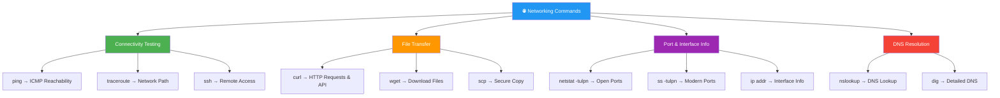

<div align="center">


# 🌐 Day 10 — Networking Commands

[](.)
[](.)
[](.)
[](.)

> *"Network issues don't announce themselves — you have to go find them with the right tools."*

</div>

---

## 📌 Introduction

Networking commands are **essential diagnostics tools** for any DevOps engineer. From checking server reachability with `ping` to downloading files with `wget`, testing REST APIs with `curl`, and checking open ports with `netstat` — these commands are part of every troubleshooting session.

> 💼 **Why it matters:** In cloud/DevOps environments, network misconfigurations cause deployment failures, broken microservice communication, and security vulnerabilities. These commands help you diagnose and fix them fast.

---

## 🧠 Key Concepts

- `ping` tests **reachability** of a host via ICMP packets
- `curl` transfers data from/to a URL — supports HTTP, HTTPS, FTP, and more
- `wget` **downloads files** from the internet
- `netstat` shows **network connections, ports, and routing tables**
- `ss` is the modern replacement for `netstat`
- `ifconfig` / `ip` show **network interface** configuration
- `traceroute` maps the **hop-by-hop path** to a destination
- `nslookup` / `dig` resolve **DNS queries**
- `ssh` provides secure **remote shell access**

---

## 📟 Commands & Examples

| Command | Description | Example |
|---------|-------------|---------|
| `ping host` | Test connectivity to a host | `ping google.com` |
| `ping -c 4 host` | Send exactly 4 ping packets | `ping -c 4 8.8.8.8` |
| `curl URL` | Fetch content from a URL | `curl https://api.github.com` |
| `curl -I URL` | Fetch HTTP headers only | `curl -I https://google.com` |
| `curl -o file URL` | Download file with curl | `curl -o app.jar https://example.com/app.jar` |
| `curl -X POST URL` | Make a POST request | `curl -X POST -d '{"key":"val"}' URL` |
| `wget URL` | Download a file | `wget https://example.com/file.zip` |
| `wget -O name URL` | Download with custom filename | `wget -O myfile.zip https://...` |
| `wget -r URL` | Recursive website download | `wget -r https://docs.example.com` |
| `netstat -tulpn` | List all listening ports | `netstat -tulpn` |
| `ss -tulpn` | Modern port listing (faster) | `ss -tulpn` |
| `ifconfig` | Show network interface info | `ifconfig` |
| `ip addr` | Modern interface info | `ip addr show` |
| `traceroute host` | Trace network path to host | `traceroute google.com` |
| `nslookup domain` | DNS lookup | `nslookup github.com` |
| `dig domain` | Detailed DNS query | `dig google.com` |
| `ssh user@host` | Connect to remote server | `ssh ubuntu@192.168.1.10` |

---

## 🔬 Practical Examples

### 📍 Example 1 — Test Connectivity and DNS Resolution
```bash
# Check if a server is reachable
ping -c 4 google.com
# Output:
# PING google.com (142.250.80.46): 56 data bytes
# 64 bytes from 142.250.80.46: icmp_seq=0 ttl=55 time=12.3 ms
# 4 packets transmitted, 4 received, 0% packet loss

# DNS lookup
nslookup github.com
# Server: 8.8.8.8
# Non-authoritative answer:
# Name: github.com
# Address: 140.82.112.3
```

### 📍 Example 2 — Test REST API with curl
```bash
# Simple GET request
curl https://api.github.com/users/octocat

# POST request with JSON body and headers
curl -X POST https://httpbin.org/post \
  -H "Content-Type: application/json" \
  -d '{"name": "devops", "env": "prod"}'

# Check HTTP response code only
curl -s -o /dev/null -w "%{http_code}" https://myapp.com/health
# Output: 200
```

### 📍 Example 3 — Check Open Ports on Server
```bash
# List all listening TCP/UDP ports
netstat -tulpn
# Output:
# Proto  Local Address    State    PID/Program
# tcp    0.0.0.0:22      LISTEN   987/sshd
# tcp    0.0.0.0:80      LISTEN   1234/nginx
# tcp    0.0.0.0:8080    LISTEN   5678/java

# Check if port 8080 is in use
ss -tulpn | grep 8080
```

---

## 🗺️ Visualization



---

## 🌍 Real-World Usage

| Scenario | Command |
|----------|---------|
| 🔍 Debug microservice connectivity | `ping service-host && curl http://service:8080/health` |
| 📥 Download Helm chart or binary | `wget https://get.helm.sh/helm-v3.tar.gz` |
| 🔌 Verify port 443 is open for HTTPS | `netstat -tulpn \| grep 443` |
| 🌐 Test API endpoint in CI/CD script | `curl -s -o /dev/null -w "%{http_code}" $API_URL` |
| 🔐 SSH into EC2 / remote server | `ssh -i key.pem ubuntu@ec2-ip` |
| 🐳 Check Docker container port mapping | `ss -tulpn \| grep 3000` |

---

## ✅ Summary

- `ping -c 4` is the quickest way to test if a host is reachable
- `curl` is far more powerful than `wget` — use it for API testing and HTTP debugging
- `wget` is the simplest tool for downloading files from URLs
- `netstat -tulpn` or `ss -tulpn` shows all open/listening ports
- `nslookup` / `dig` help debug DNS issues (wrong IP, missing records)
- These commands are used **daily** in CI/CD health checks, debugging, and monitoring

---

## ⏭️ What's Next

> 📅 **Day 11 — Package Management**
> Learn how to install, update, and remove software packages using `apt` (Debian/Ubuntu) and `yum` (RHEL/CentOS).

---

## ⭐ Support

If this helped you, please consider:

- ⭐ **Starring** this repository
- 🍴 **Forking** it to your profile
- 📢 **Sharing** with your DevOps learning community
- 👥 **Following** for daily Linux & DevOps content

<div align="center">

**Happy Learning! 🚀 One command at a time.**

</div>
