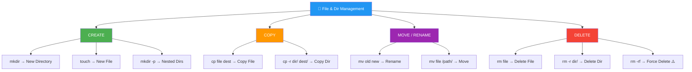

<div align="center">


# 📁 Day 02 — File & Directory Management

[](.)
[](.)
[](.)
[](.)

> *"Mastering file management is like learning to organize your workspace — essential before any real work begins."*

</div>

---

## 📌 Introduction

File and Directory management commands are **core to every Linux task** — from organizing project files to writing deployment scripts. Commands like `mkdir`, `touch`, `cp`, `mv`, and `rm` allow you to create, modify, move, and delete files and folders directly from the terminal.

> 💼 **Why it matters:** DevOps engineers constantly organize log files, create config directories, back up files, and clean up deployment artifacts using exactly these commands.

---

## 🧠 Key Concepts

- 📂 `mkdir` creates **new directories** (and nested ones with `-p`)
- 📄 `touch` creates an **empty file** or updates file timestamps
- 📋 `cp` **copies** files or directories to another location
- ✂️ `mv` **moves** files or directories (also used for renaming)
- 🗑️ `rm` **removes** files or directories permanently (use with caution!)
- Linux has **no Recycle Bin** — deleted files are gone unless backed up
- Use `-r` flag for recursive operations on directories
- Use `-i` (interactive) flag to confirm before overwriting/deleting

---

## 📟 Commands & Examples

| Command | Description | Example |
|---------|-------------|---------|
| `mkdir dirName` | Create a new directory | `mkdir projects` |
| `mkdir -p a/b/c` | Create nested directories | `mkdir -p dev/apps/web` |
| `touch file.txt` | Create an empty file | `touch notes.txt` |
| `touch f1 f2 f3` | Create multiple files at once | `touch a.txt b.txt c.txt` |
| `cp src dest` | Copy a file | `cp file.txt /backup/` |
| `cp -r dir/ dest/` | Copy directory recursively | `cp -r project/ /backup/` |
| `cp -i src dest` | Copy with overwrite confirmation | `cp -i config.txt /etc/` |
| `mv src dest` | Move or rename a file | `mv old.txt new.txt` |
| `mv dir/ /path/` | Move directory to new location | `mv app/ /opt/` |
| `rm file.txt` | Delete a file | `rm temp.txt` |
| `rm -r dir/` | Delete directory recursively | `rm -r old_project/` |
| `rm -rf dir/` | Force delete without prompt | `rm -rf /tmp/cache/` |
| `rm -i file` | Delete with confirmation prompt | `rm -i important.txt` |
| `rmdir dir` | Delete empty directory only | `rmdir empty_folder` |

---

## 🔬 Practical Examples

### 📍 Example 1 — Set Up a Project Structure
```bash
# Create nested directory structure in one command
mkdir -p myproject/{src,config,logs,scripts}

# Verify the structure
ls -R myproject/
# Output:
# myproject/:
# config  logs  scripts  src
```

### 📍 Example 2 — Copy & Move Files
```bash
# Create a config file and back it up
touch app.conf
cp app.conf app.conf.bak

# Move it to the config folder
mv app.conf /etc/myapp/config/

# Rename a file
mv app.conf.bak app_backup.conf
```

### 📍 Example 3 — Cleanup Temp Files Safely
```bash
# List temp files before deletion
ls /tmp/

# Delete specific temp files
rm /tmp/session_*.tmp

# Remove entire temp cache directory (careful!)
rm -rf /tmp/build_cache/

# Verify cleanup
ls /tmp/
```

---

## 🗺️ Visualization



---

## 🌍 Real-World Usage

| Scenario | Commands Used |
|----------|--------------|
| 🏗️ Set up deployment directory structure | `mkdir -p /opt/app/{bin,conf,logs}` |
| 📦 Backup config before changes | `cp -r /etc/nginx/ /backup/nginx_bak/` |
| 🔄 Rename a deployment folder | `mv app_v1/ app_v2/` |
| 🧹 Clean up old build artifacts in CI/CD | `rm -rf ./build/ ./dist/` |
| 📝 Create placeholder files for scripts | `touch deploy.sh health-check.sh` |
| 🐳 Docker image build prep — create dirs | `mkdir -p /app/config /app/data` |

---

## ✅ Summary

- `mkdir` (with `-p`) creates directories and full nested paths in one command
- `touch` is the fastest way to create empty files or update timestamps
- `cp` safely copies files; always use `-r` for directories
- `mv` both moves and renames — a versatile command used constantly
- `rm -rf` is **powerful and irreversible** — use it with extreme caution
- These commands form the backbone of deployment, backup, and cleanup scripts

---

## ⏭️ What's Next

> 📅 **Day 03 — File Viewing Commands**
> Explore how to read file contents with `cat`, `less`, `more`, `head`, and `tail` — essential for log analysis and debugging.

---

## 👨‍💻 Author

<div align="center">

| | |
|---|---|
| **Name** | Your Name |
| **Role** | DevOps Engineer / Linux Learner |
| **GitHub** | [@yourusername](https://github.com/yourusername) |
| **LinkedIn** | [linkedin.com/in/yourprofile](https://linkedin.com) |

</div>

---

## ⭐ Support

If this helped you, please consider:

- ⭐ **Starring** this repository
- 🍴 **Forking** it to your profile
- 📢 **Sharing** with your DevOps learning community
- 👥 **Following** for daily Linux & DevOps content

<div align="center">

**Happy Learning! 🚀 One command at a time.**

</div>
