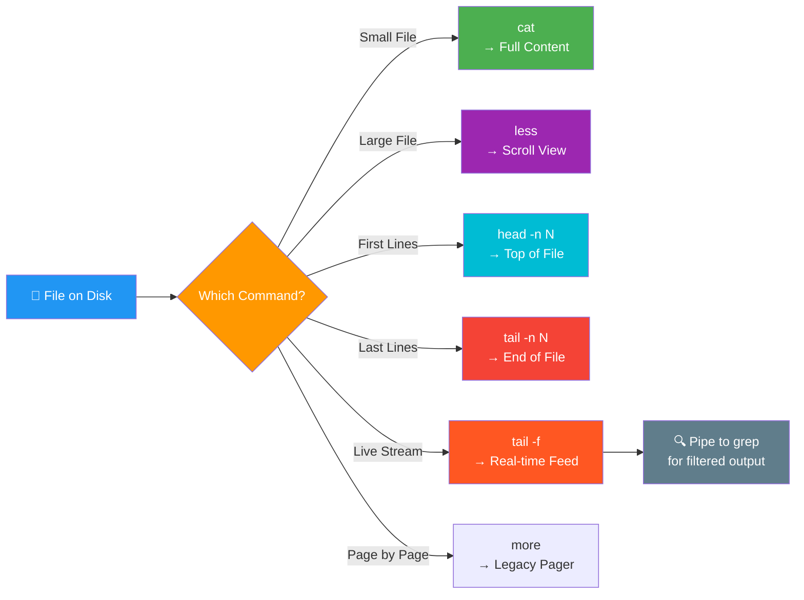

<div align="center">


# 👁️ Day 05 — File Viewing Commands

[](.)
[](.)
[](.)
[](.)

> *"Reading logs and config files efficiently is a superpower every DevOps engineer must have."*

</div>

---

## 📌 Introduction

File viewing commands let you **read file contents without opening an editor**. Tools like `cat`, `less`, `more`, `head`, and `tail` are critical for inspecting configuration files, reading logs, and debugging application output — all in real time.

> 💼 **Why it matters:** When a server crashes or a pipeline fails, the first thing you do is **read the logs**. These commands are your first line of investigation on any Linux system.

---

## 🧠 Key Concepts

- 📄 `cat` dumps **entire file content** to the terminal (best for small files)
- 📜 `less` opens files in a **scrollable, interactive viewer** (best for large files)
- 📄 `more` is similar to `less` but with **less functionality** (legacy tool)
- 🔝 `head` displays the **first N lines** of a file (default: 10)
- 🔚 `tail` displays the **last N lines** of a file (default: 10)
- `tail -f` is the **real-time log follower** — used heavily in production
- These commands **do NOT modify** the file — they're read-only tools
- Combine with `grep` for **powerful log filtering**

---

## 📟 Commands & Examples

| Command | Description | Example |
|---------|-------------|---------|
| `cat file.txt` | Display full file content | `cat /etc/hostname` |
| `cat -n file.txt` | Display with line numbers | `cat -n app.log` |
| `cat file1 file2` | Concatenate and display multiple files | `cat a.txt b.txt` |
| `less file.txt` | View file interactively (scroll up/down) | `less /var/log/syslog` |
| `more file.txt` | View file page by page | `more /etc/profile` |
| `head file.txt` | Show first 10 lines | `head access.log` |
| `head -n 20 file` | Show first N lines | `head -n 20 app.log` |
| `tail file.txt` | Show last 10 lines | `tail error.log` |
| `tail -n 50 file` | Show last N lines | `tail -n 50 app.log` |
| `tail -f file` | Follow file in real time | `tail -f /var/log/nginx/access.log` |
| `tail -F file` | Follow even if file is rotated | `tail -F app.log` |
| `wc -l file` | Count total lines in a file | `wc -l server.log` |
| `wc -w file` | Count total words in a file | `wc -w notes.txt` |

---

## 🔬 Practical Examples

### 📍 Example 1 — Read a Config File
```bash
# View entire Nginx config
cat /etc/nginx/nginx.conf

# View with line numbers (useful for debugging errors by line)
cat -n /etc/nginx/nginx.conf
# Output:
#      1  user www-data;
#      2  worker_processes auto;
#      3  ...
```

### 📍 Example 2 — Monitor Application Logs in Real Time
```bash
# Follow a log file live (Ctrl+C to stop)
tail -f /var/log/nginx/access.log
# Output (streaming):
# 192.168.1.1 - - [10/Jan/2024:09:00:01] "GET /api/health HTTP/1.1" 200
# 192.168.1.2 - - [10/Jan/2024:09:00:02] "POST /api/data HTTP/1.1" 201

# Combine tail with grep to filter errors only
tail -f app.log | grep "ERROR"
```

### 📍 Example 3 — Quick File Inspection
```bash
# See first 5 lines of a large CSV
head -n 5 data.csv
# Output:
# id,name,status,timestamp
# 1,server-01,active,2024-01-10
# 2,server-02,inactive,2024-01-09

# Count total lines (total log entries)
wc -l /var/log/syslog
# Output: 14382 /var/log/syslog
```

---

## 🗺️ Visualization



---

## 🌍 Real-World Usage

| Scenario | Command |
|----------|---------|
| 🔍 Debugging a failed Jenkins build | `tail -n 100 /var/log/jenkins/jenkins.log` |
| 🌐 Monitoring live web traffic | `tail -f /var/log/nginx/access.log` |
| ⚙️ Checking server config file | `cat /etc/ssh/sshd_config` |
| 📊 Counting log entries | `wc -l /var/log/app/error.log` |
| 🐳 Docker container log inspection | `tail -f /var/log/docker/app.log` |
| 🔔 Watching Kubernetes pod logs | `tail -f /var/log/pods/*/app.log` |

---

## ✅ Summary

- `cat` is best for small files; avoid on large log files (too much output)
- `less` is the best interactive viewer — supports search with `/keyword`
- `head` and `tail` let you zero in on the **start or end** of any file
- `tail -f` is the **go-to command for real-time log monitoring** in production
- Combine `tail -f` with `grep` to filter live logs by keyword or error level
- `wc -l` quickly tells you how large a file is before reading it

---


## ⭐ Support

If this helped you, please consider:

- ⭐ **Starring** this repository
- 🍴 **Forking** it to your profile
- 📢 **Sharing** with your DevOps learning community
- 👥 **Following** for daily Linux & DevOps content

<div align="center">

**Happy Learning! 🚀 One command at a time.**

</div>
