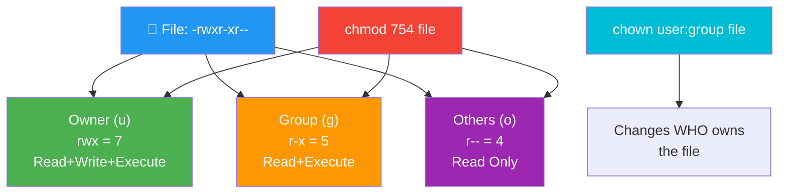

<div align="center">


# 🔐 Day 06 — File Permissions & Ownership

[](.)
[](.)
[](.)
[](.)

> *"Security starts with knowing who can read, write, and execute — on every single file."*

</div>

---

## 📌 Introduction

Linux is a **multi-user OS** — so controlling who can access which files is critical. `chmod` sets **file permissions** (read/write/execute) while `chown` sets **file ownership** (user & group). These are fundamental to securing any Linux server or DevOps environment.

> 💼 **Why it matters:** Misconfigured file permissions are one of the most common causes of **security vulnerabilities** and **deployment failures** in production systems.

---

## 🧠 Key Concepts

- Every file has **3 permission sets**: Owner (u), Group (g), Others (o)
- Each set has **3 permission types**: Read (r=4), Write (w=2), Execute (x=1)
- Permissions are displayed as: `-rwxr-xr--`
- `chmod` — changes **who can do what** with a file
- `chown` — changes **who owns** the file
- `chgrp` — changes **which group** owns the file
- Numeric mode: `chmod 755` = `rwxr-xr-x`
- `sudo` is needed to change ownership of system files

---

## 📊 Permission Table

| Symbol | Numeric | Meaning |
|--------|---------|---------|
| `r` | 4 | Read permission |
| `w` | 2 | Write permission |
| `x` | 1 | Execute permission |
| `-` | 0 | No permission |

### Common Permission Combos

| Numeric | Symbol | Meaning |
|---------|--------|---------|
| `777` | `rwxrwxrwx` | Full access to everyone ⚠️ |
| `755` | `rwxr-xr-x` | Owner full, others read+execute ✅ |
| `644` | `rw-r--r--` | Owner read+write, others read only ✅ |
| `600` | `rw-------` | Only owner can read+write 🔒 |
| `400` | `r--------` | Read-only for owner (SSH keys) 🔑 |

---

## 📟 Commands & Examples

| Command | Description | Example |
|---------|-------------|---------|
| `ls -l file` | View current permissions | `ls -l deploy.sh` |
| `chmod 755 file` | Set permissions numerically | `chmod 755 start.sh` |
| `chmod +x file` | Add execute permission | `chmod +x setup.sh` |
| `chmod -x file` | Remove execute permission | `chmod -x run.sh` |
| `chmod u+w file` | Add write for owner | `chmod u+w config.txt` |
| `chmod o-r file` | Remove read from others | `chmod o-r secret.txt` |
| `chmod -R 755 dir/` | Recursive permission change | `chmod -R 755 /opt/app/` |
| `chown user file` | Change file owner | `chown ubuntu app.log` |
| `chown user:group file` | Change owner and group | `chown www-data:www-data index.html` |
| `chown -R user dir/` | Recursive ownership change | `chown -R jenkins /var/jenkins/` |
| `chgrp group file` | Change group ownership | `chgrp devops config.yml` |
| `stat file` | View detailed file metadata | `stat deploy.sh` |
| `umask` | View/set default permissions | `umask 022` |

---

## 🔬 Practical Examples

### 📍 Example 1 — Read and Understand Permissions
```bash
ls -l /var/www/html/
# Output:
# -rw-r--r-- 1 www-data www-data 2048 Jan 10 index.html
# drwxr-xr-x 2 www-data www-data 4096 Jan 10 assets/

# Breakdown of -rw-r--r--:
# - = file (d = directory)
# rw- = owner can read + write
# r-- = group can only read
# r-- = others can only read
```

### 📍 Example 2 — Make a Script Executable
```bash
# Create a shell script
touch deploy.sh

# Check permissions (no execute yet)
ls -l deploy.sh
# -rw-r--r-- 1 ubuntu ubuntu 0 Jan 10 deploy.sh

# Add execute permission
chmod +x deploy.sh

# Verify
ls -l deploy.sh
# -rwxr-xr-x 1 ubuntu ubuntu 0 Jan 10 deploy.sh

# Now run it
./deploy.sh
```

### 📍 Example 3 — Secure a Private Key File
```bash
# SSH private keys must be 600 or SSH will refuse them
chmod 600 ~/.ssh/my-server-key.pem

# Verify
ls -l ~/.ssh/my-server-key.pem
# -rw------- 1 ubuntu ubuntu 1678 Jan 10 my-server-key.pem

# Change ownership of web server files
sudo chown -R www-data:www-data /var/www/html/
```

---

## 🗺️ Visualization



---

## 🌍 Real-World Usage

| Scenario | Command |
|----------|---------|
| 🔑 Secure SSH private key | `chmod 600 key.pem` |
| 🌐 Set up Nginx web root ownership | `chown -R www-data:www-data /var/www/html/` |
| 🚀 Make deployment script executable | `chmod +x deploy.sh` |
| 🐳 Fix Docker volume permission issues | `chmod -R 755 /app/data/` |
| 🔒 Protect sensitive config files | `chmod 640 /etc/app/secrets.conf` |
| ⚙️ Jenkins workspace permissions | `chown -R jenkins:jenkins /var/lib/jenkins/` |

---

## ✅ Summary

- Every file has permissions for **Owner**, **Group**, and **Others**
- Permissions are: **Read (4)**, **Write (2)**, **Execute (1)**
- `chmod 755` is the standard for scripts; `chmod 644` for regular files
- `chmod 600` is mandatory for SSH keys — always set this!
- `chown user:group` changes both owner and group in one command
- Use `-R` flag for applying changes **recursively** to directories

---

## ⏭️ What's Next

> 📅 **Day 07 — User Management**
> Learn how to create, modify, and delete users and groups with `useradd`, `passwd`, `userdel`, and related commands.

---


---

## ⭐ Support

If this helped you, please consider:

- ⭐ **Starring** this repository
- 🍴 **Forking** it to your profile
- 📢 **Sharing** with your DevOps learning community
- 👥 **Following** for daily Linux & DevOps content

<div align="center">

**Happy Learning! 🚀 One command at a time.**

</div>
