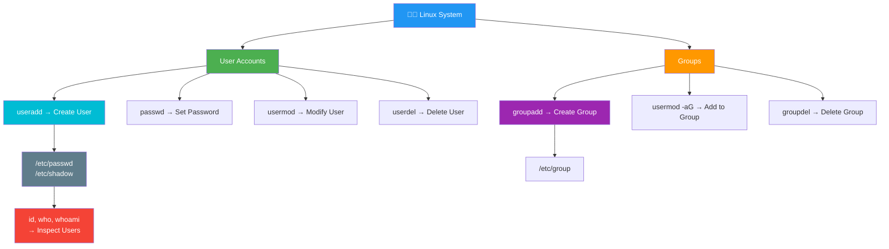

<div align="center">


# 👤 Day 07 — User Management

[](.)
[](.)
[](.)
[](.)

> *"In a multi-user OS, knowing who can do what — and controlling it — is a critical sysadmin skill."*

</div>

---

## 📌 Introduction

Linux is a **multi-user operating system** — multiple users can work on the same machine simultaneously. As a DevOps engineer, you must know how to **create, manage, and remove users and groups**, set passwords, and assign appropriate access. This is fundamental to both security and team collaboration.

> 💼 **Why it matters:** On production servers, each service (nginx, jenkins, docker) runs as its own dedicated user for **security isolation**. Mismanaging users can lead to security breaches or broken deployments.

---

## 🧠 Key Concepts

- `useradd` creates a new user account on the system
- `passwd` sets or changes a user's password
- `userdel` removes a user account (with or without home directory)
- `usermod` modifies an existing user's properties
- `groupadd` / `groupdel` manages groups
- Every user has a **UID (User ID)** and belongs to a **primary group**
- `/etc/passwd` stores user account information
- `/etc/shadow` stores encrypted passwords
- `sudo` grants a regular user **root-level privileges**

---

## 📊 Important System Files

| File | Purpose |
|------|---------|
| `/etc/passwd` | User account info (username, UID, home dir, shell) |
| `/etc/shadow` | Encrypted password storage |
| `/etc/group` | Group definitions and memberships |
| `/etc/sudoers` | Controls who can use `sudo` |
| `/home/username/` | Default home directory for each user |

---

## 📟 Commands & Examples

| Command | Description | Example |
|---------|-------------|---------|
| `useradd username` | Create a new user | `useradd devuser` |
| `useradd -m username` | Create user with home directory | `useradd -m john` |
| `useradd -s /bin/bash user` | Create user with specific shell | `useradd -s /bin/bash deploy` |
| `useradd -g group user` | Create user with primary group | `useradd -g devops alice` |
| `passwd username` | Set/change user password | `passwd john` |
| `userdel username` | Delete user (keep home dir) | `userdel olduser` |
| `userdel -r username` | Delete user + home directory | `userdel -r olduser` |
| `usermod -aG group user` | Add user to a group | `usermod -aG sudo john` |
| `usermod -l newname old` | Rename a user | `usermod -l john_new john` |
| `groupadd groupname` | Create a new group | `groupadd devops` |
| `groupdel groupname` | Delete a group | `groupdel oldgroup` |
| `id username` | Show user's UID, GID, groups | `id john` |
| `who` | Show who is logged in | `who` |
| `whoami` | Show current user | `whoami` |
| `su - username` | Switch to another user | `su - john` |
| `cat /etc/passwd` | View all user accounts | `cat /etc/passwd` |

---

## 🔬 Practical Examples

### 📍 Example 1 — Create and Set Up a New User
```bash
# Create user with home directory and bash shell
sudo useradd -m -s /bin/bash -c "DevOps Engineer" devops_user

# Set password for the user
sudo passwd devops_user
# New password: ********
# Retype new password: ********
# passwd: password updated successfully

# Verify user was created
id devops_user
# uid=1001(devops_user) gid=1001(devops_user) groups=1001(devops_user)

# Check user details in /etc/passwd
grep devops_user /etc/passwd
# devops_user:x:1001:1001:DevOps Engineer:/home/devops_user:/bin/bash
```

### 📍 Example 2 — Add User to sudo Group
```bash
# Create a new user
sudo useradd -m jenkins_user

# Add user to sudo group (for Ubuntu)
sudo usermod -aG sudo jenkins_user

# Verify group membership
groups jenkins_user
# jenkins_user : jenkins_user sudo

# Switch to the user
su - jenkins_user

# Test sudo access
sudo ls /root
```

### 📍 Example 3 — Create a Service User (No Login)
```bash
# Create a non-login system user for a service (e.g., nginx)
sudo useradd -r -s /usr/sbin/nologin -c "Nginx Web Server" nginx_svc

# Verify it has no login shell
grep nginx_svc /etc/passwd
# nginx_svc:x:999:999:Nginx Web Server:/home/nginx_svc:/usr/sbin/nologin

# Delete user when no longer needed
sudo userdel -r nginx_svc
```

---

## 🗺️ Visualization



---

## 🌍 Real-World Usage

| Scenario | Command |
|----------|---------|
| 🔧 Create a Jenkins service user | `useradd -r -s /bin/bash jenkins` |
| 🌐 Add Nginx user for web serving | `useradd -r -s /usr/sbin/nologin www-data` |
| 👥 Grant sudo to a new team member | `usermod -aG sudo newengineer` |
| 🔐 Rotate user password on server | `passwd deploy_user` |
| 🐳 Create Docker group & add user | `groupadd docker && usermod -aG docker ubuntu` |
| 🚫 Offboard leaving team member | `userdel -r exemployee` |

---

## ✅ Summary

- `useradd -m -s /bin/bash` is the standard way to create a full user account
- Always set a password with `passwd` immediately after creating a user
- `usermod -aG groupname user` is how you grant group membership (sudo, docker, etc.)
- Service accounts should use `-r` (system) and `/usr/sbin/nologin` for security
- `/etc/passwd` and `/etc/shadow` are the core user database files
- `userdel -r` removes both the user AND their home directory

---

## ⏭️ What's Next

> 📅 **Day 08 — Process Management**
> Learn how to view, monitor, and control running processes using `ps`, `top`, `kill`, and `nice`.

---

---

## ⭐ Support

If this helped you, please consider:

- ⭐ **Starring** this repository
- 🍴 **Forking** it to your profile
- 📢 **Sharing** with your DevOps learning community
- 👥 **Following** for daily Linux & DevOps content

<div align="center">

**Happy Learning! 🚀 One command at a time.**

</div>
