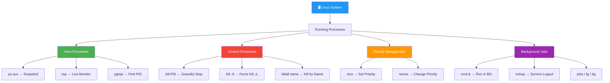

<div align="center">


# ⚙️ Day 07 — Process Management

[](.)
[](.)
[](.)
[](.)

> *"If you can't see what's running on your server, you can't manage it — and you can't debug it."*

</div>

---

## 📌 Introduction

Every running application on Linux is a **process**. Process management is the ability to **view, monitor, prioritize, and terminate** processes. Commands like `ps`, `top`, `kill`, and `nice` give you full control over what's running on your server — a core skill for any DevOps or sysadmin role.

> 💼 **Why it matters:** High CPU/memory usage, zombie processes, and crashed services are daily production challenges. Knowing how to investigate and fix them quickly is essential.

---

## 🧠 Key Concepts

- Every process has a unique **PID (Process ID)**
- Processes have a **parent-child** relationship (PPID = Parent PID)
- `ps` — **snapshot** of currently running processes
- `top` — **live, real-time** process monitor
- `kill` — sends a **signal** to a process (default: terminate)
- `nice` — sets the **priority** of a process (-20 = highest, 19 = lowest)
- `renice` — changes priority of a **running** process
- `&` — runs a command in the **background**
- `jobs` — lists background jobs in the current shell

---

## 📊 Common Kill Signals

| Signal | Number | Meaning |
|--------|--------|---------|
| `SIGTERM` | 15 | Graceful termination (default) |
| `SIGKILL` | 9 | Force kill — cannot be ignored |
| `SIGHUP` | 1 | Reload config (hang up) |
| `SIGSTOP` | 19 | Pause a process |
| `SIGCONT` | 18 | Resume a paused process |

---

## 📟 Commands & Examples

| Command | Description | Example |
|---------|-------------|---------|
| `ps` | List processes for current shell | `ps` |
| `ps aux` | List ALL processes (all users) | `ps aux` |
| `ps aux \| grep nginx` | Find a specific process | `ps aux \| grep nginx` |
| `top` | Live process monitor (interactive) | `top` |
| `htop` | Enhanced interactive process viewer | `htop` |
| `kill PID` | Gracefully stop a process | `kill 1234` |
| `kill -9 PID` | Force kill a process | `kill -9 1234` |
| `killall name` | Kill all processes by name | `killall nginx` |
| `pkill name` | Kill processes matching pattern | `pkill -f "python app.py"` |
| `nice -n 10 cmd` | Start command with low priority | `nice -n 10 backup.sh` |
| `renice -n 5 -p PID` | Change priority of running process | `renice -n 5 -p 1234` |
| `bg` | Resume job in background | `bg %1` |
| `fg` | Bring background job to foreground | `fg %1` |
| `jobs` | List background jobs | `jobs` |
| `nohup cmd &` | Run command immune to hangup | `nohup ./server.sh &` |
| `pgrep name` | Get PID of process by name | `pgrep nginx` |

---

## 🔬 Practical Examples

### 📍 Example 1 — Find and Kill a Stuck Process
```bash
# List all processes and find nginx
ps aux | grep nginx
# Output:
# www-data  1234  0.0  0.1  nginx: worker process
# ubuntu    5678  0.0  0.0  grep nginx

# Kill the process gracefully
kill 1234

# If it doesn't stop, force kill
kill -9 1234

# Or kill all nginx processes at once
sudo killall nginx
```

### 📍 Example 2 — Monitor System in Real Time with top
```bash
# Launch top
top
# Interactive commands inside top:
# q → quit
# k → kill a process (enter PID)
# r → renice (change priority)
# M → sort by memory usage
# P → sort by CPU usage
# 1 → show individual CPU cores

# Kill a specific process by name directly
kill -9 $(pgrep java)
```

### 📍 Example 3 — Run a Process in Background
```bash
# Run a long script in background
nohup ./long-backup.sh &
# Output: [1] 7890

# Check background jobs
jobs
# [1]+ Running   nohup ./long-backup.sh &

# Bring it to foreground
fg %1

# Suspend it (Ctrl+Z), then send back to background
bg %1
```

---

## 🗺️ Visualization



---

## 🌍 Real-World Usage

| Scenario | Command |
|----------|---------|
| 🔥 Kill a high-CPU Java process | `kill -9 $(pgrep java)` |
| 🌐 Restart a crashed Nginx worker | `killall nginx && nginx` |
| 📊 Monitor server load during deploy | `top` or `htop` |
| 🤖 Run CI/CD script without session expiry | `nohup ./deploy.sh &` |
| ⚖️ Lower priority of backup job | `nice -n 15 ./backup.sh` |
| 🐳 Find and kill zombie Docker process | `ps aux \| grep zombie` then `kill -9 PID` |

---

## ✅ Summary

- `ps aux` gives a full snapshot of every running process with CPU/memory stats
- `top` is the live dashboard for real-time server monitoring
- `kill -9` is the last resort — prefer graceful `kill` (signal 15) first
- `nohup cmd &` is the standard way to run long-running scripts on remote servers
- `nice` / `renice` let you control resource allocation across competing processes
- `pgrep` / `pkill` let you target processes by name instead of PID

---

## ⏭️ What's Next

> 📅 **Day 08 — Disk & Memory Commands**
> Learn how to check disk usage, free space, and memory consumption using `df`, `du`, and `free`.

---

## 👨‍💻 Author

<div align="center">

| | |
|---|---|
| **Name** | Vadla Gunasekhar |
| **Role** | DevOps Engineer / Linux Learner |
| **GitHub** | [@gunasekharvadla](https://github.com/gunasekharvadla) |

</div>

---

## ⭐ Support

If this helped you, please consider:

- ⭐ **Starring** this repository
- 🍴 **Forking** it to your profile
- 📢 **Sharing** with your DevOps learning community
- 👥 **Following** for daily Linux & DevOps content

<div align="center">

**Happy Learning! 🚀 One command at a time.**

</div>
