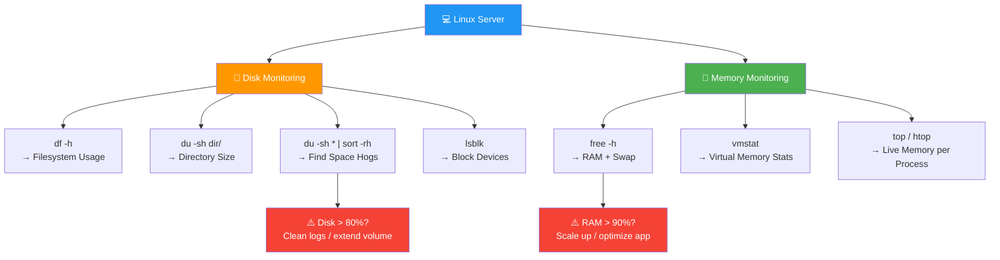

<div align="center">


# 💾 Day 08 — Disk & Memory Commands

[](.)
[](.)
[](.)
[](.)

> *"A full disk or exhausted memory brings down even the most well-architected server. Know your resources."*

</div>

---

## 📌 Introduction

Monitoring **disk space and memory usage** is a daily responsibility in any DevOps role. Commands like `df`, `du`, and `free` help you track storage consumption, find space hogs, and understand memory allocation — before they become production incidents.

> 💼 **Why it matters:** Disk-full errors crash databases, stop log rotation, and break CI/CD pipelines. Memory exhaustion causes OOM (Out of Memory) kills and service outages. Catching these early saves downtime.

---

## 🧠 Key Concepts

- `df` — reports **disk space usage** of entire file systems
- `du` — shows **disk usage** of specific files and directories
- `free` — displays **RAM and swap memory** usage
- `-h` flag = **human-readable** output (KB, MB, GB)
- **Swap** = disk space used as virtual memory when RAM is full
- `lsblk` — lists all **block devices** (disks, partitions)
- `fdisk` — for **partitioning** disks (advanced)
- Disk usage alerts are typically set at **80% threshold** in production

---

## 📊 Memory Terminology

| Term | Meaning |
|------|---------|
| `total` | Total installed RAM |
| `used` | Memory currently in use |
| `free` | Completely unused memory |
| `available` | Memory available for new processes (incl. cache) |
| `shared` | Memory shared between processes |
| `buff/cache` | Memory used by kernel buffers and cache |
| `swap` | Disk-based virtual memory overflow |

---

## 📟 Commands & Examples

| Command | Description | Example |
|---------|-------------|---------|
| `df` | Show disk space for all filesystems | `df` |
| `df -h` | Human-readable disk space | `df -h` |
| `df -hT` | Show filesystem type too | `df -hT` |
| `df -h /var` | Disk usage of specific path | `df -h /var` |
| `du -h file` | Size of a specific file | `du -h app.log` |
| `du -sh dir/` | Summary size of directory | `du -sh /var/log/` |
| `du -ah dir/` | All files with sizes | `du -ah /home/` |
| `du -sh * \| sort -rh` | Sort dirs by size (largest first) | `du -sh /var/* \| sort -rh` |
| `free` | Show RAM and swap usage | `free` |
| `free -h` | Human-readable memory info | `free -h` |
| `free -m` | Memory in megabytes | `free -m` |
| `lsblk` | List all block devices | `lsblk` |
| `lsblk -f` | Show filesystem type | `lsblk -f` |
| `iostat` | CPU and disk I/O statistics | `iostat -x 1` |
| `vmstat` | Virtual memory statistics | `vmstat 1 5` |

---

## 🔬 Practical Examples

### 📍 Example 1 — Check Disk Space Across the Server
```bash
# Human-readable disk usage of all mounted filesystems
df -hT
# Output:
# Filesystem     Type   Size  Used Avail Use% Mounted on
# /dev/xvda1     ext4    30G   12G   17G  42% /
# tmpfs          tmpfs  2.0G     0  2.0G   0% /dev/shm
# /dev/xvdb1     ext4   50G   38G   10G  79% /var/log  ← ⚠️ Almost full!

# Check only a specific path
df -h /var/log
```

### 📍 Example 2 — Find What's Eating Your Disk
```bash
# Find the 10 largest directories under /var
du -sh /var/* 2>/dev/null | sort -rh | head -10
# Output:
# 35G    /var/log
# 4.2G   /var/lib
# 512M   /var/cache
# 128M   /var/tmp

# Find large files in /var/log
find /var/log -type f -size +100M
# /var/log/app/debug.log  (1.2G)
```

### 📍 Example 3 — Check RAM and Swap Usage
```bash
# Show memory in human-readable format
free -h
# Output:
#               total        used        free      shared  buff/cache   available
# Mem:           7.6G        3.1G        512M        256M        4.0G        4.2G
# Swap:          2.0G        400M        1.6G

# Check memory every 2 seconds, 5 times
vmstat 2 5
```

---

## 🗺️ Visualization



---

## 🌍 Real-World Usage

| Scenario | Command |
|----------|---------|
| 🔔 Server disk alert — find what's full | `df -h && du -sh /var/* \| sort -rh` |
| 🧹 Clean up Jenkins build artifacts | `du -sh /var/lib/jenkins/workspace/` |
| 📊 Pre-deployment RAM check | `free -h` |
| 🐳 Check Docker image disk usage | `du -sh /var/lib/docker/` |
| 🔍 Find large log files to rotate | `find /var/log -size +500M` |
| ☁️ AWS — before resizing EBS volume | `df -hT` to identify usage |

---

## ✅ Summary

- `df -h` gives an instant overview of all filesystem disk usage
- `du -sh *` reveals which directories are consuming the most space
- Combine `du` with `sort -rh` to rank directories from largest to smallest
- `free -h` shows both RAM and swap usage in one clear view
- Monitor disk at **80% threshold** and RAM at **85% threshold** to avoid incidents
- `lsblk` is your starting point for understanding attached storage volumes

---

## ⏭️ What's Next

> 📅 **Day 09 — Networking Commands**
> Learn to diagnose connectivity, test APIs, and download files using `ping`, `netstat`, `curl`, and `wget`.

---

## ⭐ Support

If this helped you, please consider:

- ⭐ **Starring** this repository
- 🍴 **Forking** it to your profile
- 📢 **Sharing** with your DevOps learning community
- 👥 **Following** for daily Linux & DevOps content

<div align="center">

**Happy Learning! 🚀 One command at a time.**

</div>
